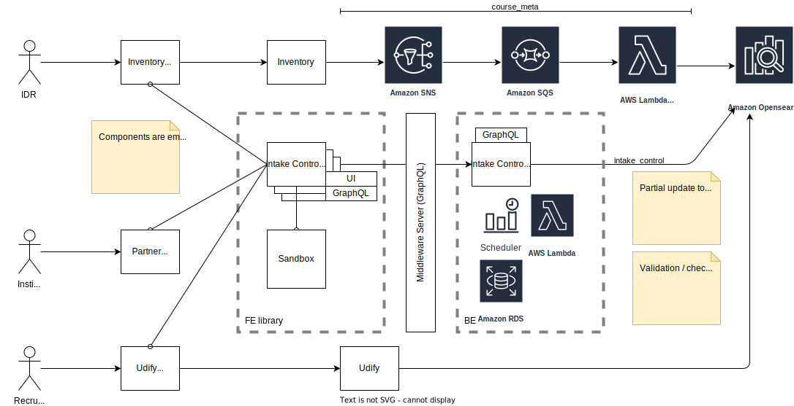

# INSTITUTION CONTROL SERVICE

This is a service that provides a GraphQL Endpoints for managing institutions control and scheduling intake close.

## Architecture Diagram



### Deployment

Clone the repository and install the dependencies:

```
git clone git@bitbucket.org:udifyco/institution-control-service.git
cd institution-control-service
npm install
```

and then deploy with:

```
serverless deploy
```

After running deploy, you should see output similar to:

```bash
Deploying aws-node-express-api-project to stage dev (us-east-1)

✔ Service deployed to stack aws-node-express-api-project-dev (196s)

endpoint: ANY - https://xxxxxxxxxx.execute-api.us-east-1.amazonaws.com
functions:
  api: aws-node-express-api-project-dev-api (766 kB)
```

_Note_: In current form, after deployment, your API is public and can be invoked by anyone. For production deployments, you might want to configure an authorizer. For details on how to do that, refer to [`httpApi` event docs](https://www.serverless.com/framework/docs/providers/aws/events/http-api/).

### Invocation

After successful deployment, you can call the created application via HTTP:

```bash
curl https://xxxxxxx.execute-api.us-east-1.amazonaws.com/
```

Which should result in the following response:

```
{"message":"Hello from root!"}
```

Calling the `/hello` path with:

```bash
curl https://xxxxxxx.execute-api.us-east-1.amazonaws.com/hello
```

Should result in the following response:

```bash
{"message":"Hello from path!"}
```

If you try to invoke a path or method that does not have a configured handler, e.g. with:

```bash
curl https://xxxxxxx.execute-api.us-east-1.amazonaws.com/nonexistent
```

You should receive the following response:

```bash
{"error":"Not Found"}
```

### Local development

It is also possible to emulate API Gateway and Lambda locally by using `serverless-offline` plugin. In order to do that, execute the following command:

```bash
serverless plugin install -n serverless-offline
```

It will add the `serverless-offline` plugin to `devDependencies` in `package.json` file as well as will add it to `plugins` in `serverless.yml`.

After installation, you can start local emulation with:

```
serverless offline
```

To learn more about the capabilities of `serverless-offline`, please refer to its [GitHub repository](https://github.com/dherault/serverless-offline).
